# Legally Subjective

> **Subjectivity, measured.** — Measuring the upper bound of predictability
> in U.S. Supreme Court decisions, using public data and a zero-euro budget.


---

## The question

Can a language model predict a justice's vote from the case file alone,
without the verdict? And if we teach it one specific justice's *style* —
their persona — does it get better on that justice's **future** cases?
Both outcomes publish:

1. **Yes** — the persona is extractible from public text; judicial
   subjectivity leaves a measurable footprint.
2. **No** — the persona adds nothing beyond style; the essential part of
   the decision is not in the public data.

In both cases, the measurement itself is the result.

The project is built like an experiment, not a product: a frozen corpus,
pre-registered baselines, sealed test cases, and a site that displays the
true state of the program at every step — never an invented prediction.

---

## The record


**Corpus-Monde v1** (frozen 2026-08-28): every argued Supreme Court case
from OT2015 to OT2023 — CourtListener metadata fused with SCDB 2025_01
votes, every source hash-chained.

| | |
|---|---|
| **569** argued cases | 9 terms, window 2015-10-01 → 2024-06-30 |
| **13** justices | each with a FILED docket, LS-J-001 … LS-J-013 |
| **1,778** opinions | majority, dissent, concurrence — inventory |
| **4,730** recorded votes | 96.1% of cases carry SCDB votes |
| **98.6%** audio coverage | oral argument + transcript, multimodal-ready |

---

## The bar


Before any model is trained, the statistical baselines fix the price of
admission (test set OT2020–2023, Wilson 95% intervals):

| Baseline | Accuracy | 95% CI |
|---|---|---|
| B1 — Majority class (liberal), OT2015–2019 prior | 43.6% | [37.2; 50.1] |
| B4c — Per-justice ideology, case level | 55.8% | [49.3; 62.2] |
| B2 — Always conservative | 56.4% | [49.9; 62.8] |
| B3 — Always reverse the court below | 60.1% | [51.8; 67.9] |
| **B4 — Per-justice ideology, vote level** | **63.7%** | **[61.3; 65.9]** |

Detail: [`results/m2_baselines.md`](results/m2_baselines.md)

Any model that claims to read the law must beat **63.7% of votes** —
knowing nothing but each justice's ideological lean. That is the number
the whole project is organized around.

---

## The first challenger

On 2026-08-29 the first model was trained — everything the case file
knows *before* the decision (issue area, lower-court disposition, term,
argument length, justice identity), the sealed 50 excluded from every
split. **The bar held.**

| Challenger (transparent test, sealed excluded) | Accuracy | vs B4 |
|---|---|---|
| M3a-LR — additive logistic regression | 58.6% | p = 0.002 |
| M3a-GB — gradient boosting | 59.8% | p = 0.009 |
| M3a-IX — with justice×issue interactions | 60.4% | p = 0.047 |
| **B4 — per-justice ideology, same rows** | **63.1%** | reference |

Reading: justice identity is the only stable signal in the structured
world — *who* votes beats *what the case is about*. Justices do
specialize by domain (interactions recover part of it), but not enough
to clear the bar. Consequence: if 63.7% is beatable, the signal lives
in the **text** — which is exactly what conditions A/B/C will test once
the opinion corpus (M1.5, dripping) is complete. A null result is a
result: the price of admission is now empirically priced.

Detail: [`results/m3a_report.md`](results/m3a_report.md)

---

## The paper

The working paper — corpus, protocol, M2 baselines, agreement, and the
M3a null result, in the format researchers read — lives in
[`paper/`](paper/) (LaTeX sources, `main.pdf` compiled with Tectonic;
figures regenerate via `scripts/paper_figures.py`):

> **Legally Subjective: Measuring the Upper Bound of Predictability in
> U.S. Supreme Court Decisions with Public Data and a Zero Budget** —
> A. Harch el Korane, working paper, 2026-08-29. 12 pages, 4 figures,
> 5 tables, 12 references.

---

## The lock


Seventy-nine decisions came down 5–4. Fifty of them are **sealed** until
the Final Test: selected deterministically (Random MT, seeded by the
SHA-256 of the sorted 5–4 list), frozen by hash, never trained on, never
tuned on. The model will face them blind.

The Final Test runs four conditions on the same hold-out:

| Condition | Description |
|---|---|
| **A — Zero-shot** | Llama 3 8B decides from the dossier alone — no learning of its own |
| **B — Persona** | the same model, QLoRA-finetuned on a justice's **past** opinions; tested on that justice's **future** cases |
| **C — Context** | the same model + retrieval of similar earlier opinions (RAG) |
| **D — Statistical** | the baselines above |

**The decisive test**: B > A on never-seen future cases ⟹ the persona is
extractible. B = A ⟹ the justice's personality is not in the public data.
Both outcomes are results.

---

## The bench



Sixty pairs, each measured on their common votes (2015–2024). The closest
pair: Kavanaugh–Roberts, **94.6%** [91.6; 96.8]. The widest gap:
Sotomayor–Thomas, **54.3%** [50.0; 58.5]. Ordered conservative to liberal,
the blocks tell the story before the numbers do.

---

## The storefront


The site (Next.js) is the experiment's public face — [run it locally](#reproduce),
or read it like a case file:

| Route | What it files |
|---|---|
| `/` | **THE DRAW** — spin the bench; the wheel files a justice's record: disposition rate, Wilson interval, votes. Receipts only |
| `/court` | the thirteen justices, their filed dockets LS-J-001…013 |
| `/cases` · `/case/[id]` | all 569 cases — with **the baseline's call** on each (honest: the model is M3-pending) |
| `/judge/[slug]` · `/compare` | divergence by issue area; sixty-pair agreement |
| `/paper` | LS-R-002 — the research record |
| `/standard` | LS-1.0 — the subjectivity fingerprint standard |
| `/system-state` | the true state of the program, read live from the data |

The site runs entirely on the frozen corpus: thirteen re-measured LS-J
dockets (seals verifiable via `scripts/verify_dockets.py`), the 569-case
record, the B5 inter-judge agreement, the M2 baselines. The AI conditions
(A/B/C) are not trained yet (M3); every page that concerns them displays
the real state of the program — the statistical baseline, never an
invented prediction.

---

## What's in the repository

| Item | Content |
|---|---|
| `data/processed/corpus_cases_v1.jsonl.gz` | **Frozen Corpus-Monde v1**: 569 argued cases, CourtListener + SCDB fused |
| `data/processed/corpus_opinions_v1.jsonl.gz` | Inventory of 1,778 opinions |
| `data/processed/corpus_justices_v1.jsonl.gz` | ~5,000 justice×case vote rows |
| `data/processed/stats_v1.json` | Corpus rule, statistics, **50 sealed 5–4 cases** (SHA-256) |
| `data/dockets/` | The 13 FILED justice dockets + MANIFEST |
| `data/productions/` | The site's data layer: cases, agreement, research state, custody |
| `data/raw/provenance/` | SHA-256 of every raw source + exact filter predicates |
| `results/m2_baselines.{json,md}` | M2 statistical baselines, Wilson 95% |
| `docs/` | Vision, methodology, corpus, baselines, protocol, reproducibility, ethics, roadmap, limits, resources, **visual guide** |
| `docs/assets/` | The exhibits above — adaptive SVGs (LS-EXHIBIT-1.1: transparent, dark/light-aware, text as paths) |
| `scripts/` | The full, reproducible collection and build chain |
| `src/`, `public/`, `prisma/` | The site (Next.js) |

---

## Reproduce

```bash
npm ci
npm run dev        # http://localhost:3000
```

Verify the corpus integrity:

```bash
git clone https://github.com/Vitalcheffe/legally-subjective.git
cd legally-subjective
python3 - <<'EOF'
import json
stats = json.load(open('data/processed/stats_v1.json'))
print(stats['n_cases'], 'cases |', stats['n_opinions'], 'opinions')
print('sealed 5-4 :', stats['five_four_selection']['sealed_sha256'])
EOF
```

The full rebuild chain (bulk downloads → filters → corpus) is documented
in [`docs/05-REPRODUCTIBILITE.md`](docs/05-REPRODUCTIBILITE.md). The
exhibits in this README regenerate from the live data in one command:

```bash
python3 scripts/make_exhibits.py   # -> docs/assets/*.svg
```

They are pure SVG, drawn from the frozen corpus — no screenshots, no
browser step. See [`docs/10-VISUAL-GUIDE.md`](docs/10-VISUAL-GUIDE.md).

---

## Principles

- **Zero euro, forever** — free Colab/Kaggle compute, public data, no paid
  service at any step.
- **Amateur, seriously** — playable, criticizable, verifiable by anyone;
  rigorous enough to interest a researcher.
- **Total provenance** — every file has its SHA-256, every rule its
  predicate, every exception its note.
- **No commercialization** — no product, no paywall, no private data.

---

## Documentation

| Document | Content |
|---|---|
| [`docs/00-VISION.md`](docs/00-VISION.md) | The question, the ethics, the positioning |
| [`docs/01-METHODOLOGIE.md`](docs/01-METHODOLOGIE.md) | The four conditions, the decisive test |
| [`docs/02-CORPUS.md`](docs/02-CORPUS.md) | The corpus rule, its statistics, its known flaws |
| [`docs/03-BASELINES.md`](docs/03-BASELINES.md) | The M2 baselines and how to read them |
| [`docs/04-PROTOCOLE.md`](docs/04-PROTOCOLE.md) | The Final Test: sealing, pre-registration |
| [`docs/05-REPRODUCTIBILITE.md`](docs/05-REPRODUCTIBILITE.md) | Rebuild everything, verify the hashes |
| [`docs/06-ETHIQUE.md`](docs/06-ETHIQUE.md) | Public data, labeled counterfactuals |
| [`docs/07-ROADMAP.md`](docs/07-ROADMAP.md) | Where we are, where we go |
| [`docs/08-LIMITES.md`](docs/08-LIMITES.md) | What this project cannot prove |
| [`docs/09-RESSOURCES.md`](docs/09-RESSOURCES.md) | Other public legal data sources (US, Europe, world) |
| [`docs/10-VISUAL-GUIDE.md`](docs/10-VISUAL-GUIDE.md) | LS-EXHIBIT-1.0 — how the exhibits are made |
| [`docs/11-REPORT-A-Z.md`](docs/11-REPORT-A-Z.md) | **The project, A to Z** — the full report |

(Primary documentation is progressively migrating from French to English;
the deep docs remain in French for now — the data and code are language-neutral.)

---

## Cite

```bibtex
@software{harch_el_korane_2026_legally,
  author = {Amine Harch el Korane},
  title = {Legally Subjective: Subjectivity, measured},
  year = {2026},
  url = {https://github.com/Vitalcheffe/legally-subjective},
}
```

---

## Data sources

- [CourtListener](https://www.courtlistener.com) (Free Law Project) —
  dockets, opinions, oral arguments, transcripts. Bulk files 2026-06-30 +
  API v4.
- [Supreme Court Database (SCDB)](http://scdb.wustl.edu) — per-justice
  votes, decision directions, edition 2025_01.
- All data is public; see `data/raw/provenance/` for the exact
  fingerprints.

---

*Lire ceci en français : [`README.fr.md`](README.fr.md)*
