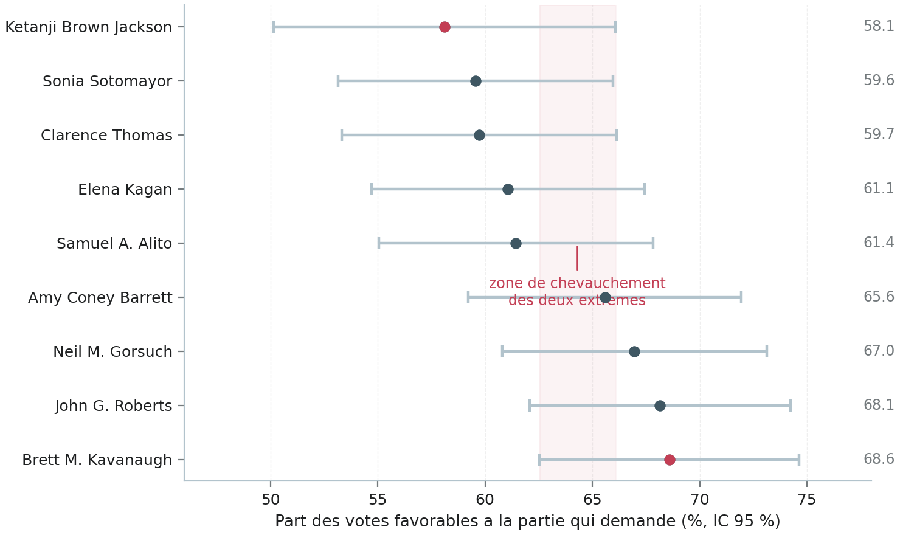
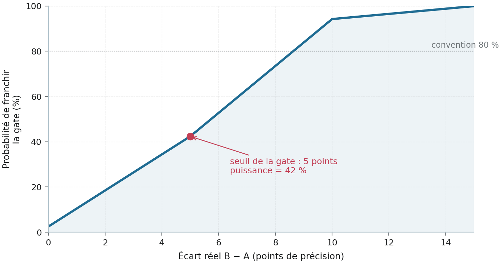
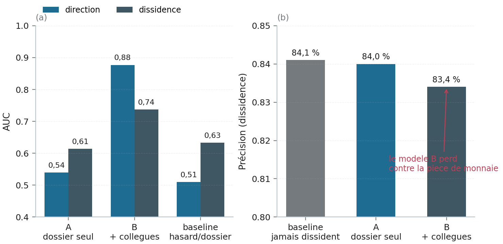

# Légalement Subjective sous examen — rapport d'instruction

> **Dossier LS-AUDIT-001 · établi le 27 août 2026 · commit 3ec9f3b · dépôt Vitalcheffe/legally-subjective**
>
> Rapport d'instruction interne : le projet passe au tribunal de sa propre
> méthode. Chaque chiffre a été recalculé depuis les pièces du dépôt.
> Huit chefs d'accusation, trois témoins hostiles, six scénarios de mort,
> une sentence en douze injonctions. Le but : survivre aux commentaires
> des autres.

---

## 1 · Exposé du dossier

Le fondateur a assigné son propre projet à comparaître. Le mandat reçu est sans ambiguïté : être cruel, être impartial comme un juge, peser le pour et le contre, plaider contre soi-même — parce qu'un projet trop gentil avec lui-même est un projet mort, et que la pire version de nous-mêmes doit être écrite par nous avant qu'un inconnu ne l'écrive à notre place. Le présent rapport exécute ce mandat. Il instruit à charge d'abord, à décharge ensuite, et ne prononce la sentence qu'après avoir pesé les deux plateaux de la balance.

Le prévenu : <b>Légalement Subjective</b>, projet open source qui prétend mesurer la subjectivité judiciaire. Sa vitrine publique est une roulette — « YOU DON'T PICK YOUR JUDGE » — qui fait tomber le nom d'un juge de la Cour suprême des États-Unis avec un chiffre géant rouge, sur une fenêtre de 237 affaires décidées entre octobre 2020 et août 2026. Son arrière-boutique est un programme de recherche en huit phases — le « Projet Manhattan du Droit » — dont la Phase 1 oppose un modèle de langage vierge à un modèle fine-tuné sur 600 affaires criminelles new-yorkaises, et dont la porte de sortie est un article arXiv, une validation humaine et un module darwinien auto-découvreur de variables.

Le standard de preuve de cette instruction est celui que le projet réclame pour lui-même : <b>aucun chiffre ne sera cru sur parole</b>. Chaque nombre cité dans ce rapport a été recalculé par le juge, depuis les fichiers bruts du dépôt, au commit 3ec9f3b (branche main, synchronisée avec origin). Quand la vitrine affiche « 56,95 % », le juge a recompté les votes. Quand le manifeste annonce « 600/400 », le juge a rouvert le rapport de découpe. Quand le article de recherche revendique une AUC de 0,877, le juge a lu l'artefact du modèle. Les pièces sont décrites à l'Annexe B pour que quiconque puisse refaire ce que ce rapport a fait.

Une précision de méthode, pour l'impartialité : ce rapport distingue systématiquement « la vitrine » (le site public, ses pages, ses chiffres affichés) et « le fond » (les données, les scripts, l'article de recherche, la feuille de route). Les deux sont jugés séparément parce qu'ils ne promettent pas la même chose et ne portent pas le même risque. La vitrine parle à des humains qui risquent la prison ; le fond parle à des relecteurs qui risquent de dire non. Un projet peut être innocent dans son fond et coupable dans sa vitrine. C'est précisément la thèse de l'accusation.

342 | 1 677 | 8
--- | --- | ---
fichiers Oyez examinés | affaires criminelles NY dans le corpus | chefs d'accusation retenus

## 2 · L'expertise : ce qui existe réellement

### 2.1 · La question de l'authenticité, close par les pièces

Le fondateur a confié un jour ne jamais avoir rien exécuté et soupçonner ses propres données. L'expertise commence donc par la question la plus basse et la plus grave : le projet est-il réel ? La réponse est oui, et elle mérite d'être écrite noir sur blanc parce qu'elle conditionne tout le reste. Le dépôt contient 342 fichiers de cache Oyez dont 329 exploitables, chacun portant son URI source et sa date de récupération ; 13 requêtes ratées sont archivées comme telles, avec leur suffixe « .miss », plutôt que dissimulées. La matrice d'accord affichée par le site se recalcule exactement depuis ces fichiers. Neuf dossiers de juge existent, chacun avec ses effectifs, ses définitions d'axes et ses limites déclarées.

Côté recherche, le corpus criminel new-yorkais est matériellement là : 1 677 affaires collectées, chaque requête HTTP consignée dans un journal de collecte, chaque document hashé en sha256. Le test de régression doré — cinq affaires vérifiées à la main que le prétraitement doit reproduire à l'identique — repasse « 5/5 » sur la branche principale. Le script d'entraînement existe, tourne, fixe sa graine, valide par groupes d'affaires, et écrit ses résultats dans un artefact qui conserve les versions logicielles. Le notebook Colab de la Phase 1 est généré, validé syntaxiquement, prêt pour un T4. En un mot : <b>le prévenu n'est pas une façade</b>. C'est l'un des rares projets de ce genre où l'on peut remonter chaque chiffre public jusqu'aux octets du cache source.

### 2.2 · Inventaire des pièces

| Pièce | Contenu vérifié | État |
| --- | --- | --- |
| Oyez (cache) | 342 fichiers ; 329 exploitables ; 232 avec décision et votes exploitables | réel, traçable |
| Dockets judiciaires | 9 juges ; 5 axes mesurés ; axe orality « données insuffisantes » assumé | réel |
| Matrice d'accord | 36 paires ; n de 149 à 232 ; fenêtre oct. 2020 – août 2026 | recalculée, conforme |
| Corpus criminel NY | 1 677 affaires ; journal de collecte ; sha256 des documents | réel |
| Dataset Phase 1 | 1 677 → 1 027 pool propre → 600 entraînement / 400 test | conforme au roadmap |
| Modèle entraîné | régression logistique L2 ; validation croisée groupée ; prédictions hors-fold publiées | réel, exécutable |
| Article LS-R-001 | 7 sections, 5 figures, 3 tables, 12 références réelles, section Limitations | publié sur /paper |
| Site public | des centaines de pages statiques ; zéro occurrence du mot « convict » | construit, déployable |
| Git | 18 commits signés du même auteur ; branches d'archive conservées | discipliné |

*Tableau 1 — Inventaire des pièces versées au dossier (commit 3ec9f3b).*

### 2.3 · Ce que le fond a réellement démontré

Le modèle entraîné sur les votes réels de la Cour produit trois résultats solides que l'accusation ne conteste pas, parce qu'ils sont honnêtement présentés dans l'article de recherche. Premièrement, le dossier seul ne prédit pas le vote : la spécification « A », qui ne voit que le dossier, plafonne à une AUC de 0,540 en direction — à peine mieux qu'un tirage au sort. Deuxièmement, les collègues prédisent le vote : la spécification « B », qui voit le momentum des huit autres juges, atteint 0,877. Troisièmement, l'identité du juge compte et l'année ne compte pas : le khi-deux croisant dissidence et juge vaut 88,04 avec p inférieur à 0,001, tandis que le khi-deux croisant dissidence et session judiciaire est non significatif (p = 0,414). Ces trois énoncés sont défendables, publiables, et vérifiables ligne à ligne grâce aux prédictions hors-fold publiées.

La Phase 1 du Projet Manhattan est matériellement avancée au-delà de ce que le roadmap laissait espérer à sa rédaction : le collecteur a tourné (1 677 affaires), la découpe 600/400 existe avec une gate anti-fuite vérifiée sur les mille textes, et le notebook d'expérience attend seulement un GPU. L'expertise prend acte de ce travail. Mais l'expertise n'est pas un acquittement : elle établit que les fondations sont réelles. Le réquisitoire qui suit porte sur l'édifice qu'on a construit dessus, et sur la manière dont il est montré au public.

> **p = 0,040** — la significativité exacte de l'écart vedette de la vitrine — un cran au-dessus du seuil, sans aucune correction de multiplicité. C'est le nombre le plus dangereux du projet, et le chapitre 3 commence par lui.

## 3 · Le réquisitoire

Le ministère public retient huit chefs d'accusation. Aucun ne reproche au projet d'avoir inventé : la loi zéro-simulation est respectée, et l'expertise le reconnaît. Les huit chefs reprochent autre chose — des certitudes affichées que le moteur ne délivre pas, des protocoles à venir écrits comme s'ils étaient déjà des preuves, et des coutures invisibles au public. Chaque chef est instruit avec ses pièces.

### Chef I — Des chiffres en costume de certitude

z = 2,05 | p = 0,040 | ± 7,9 pts
--- | --- | ---
l'écart vedette de la roue, sous forme de test | sa significativité, sans correction | l'intervalle à 95 % du chiffre le plus dramatique

La roulette affiche « 58 OUT OF 100 » et « 69 OUT OF 100 » — dix points d'écart entre Jackson et Kavanaugh, présentés comme « dix points de vie sur le hasard d'un couloir ». Le juge a recalculé. Kavanaugh : 68,58 % sur 226 votes, intervalle à 95 % plus ou moins 6,1 points. Jackson : 58,11 % sur 148 votes, intervalle plus ou moins 7,9 points. La différence observée vaut z = 2,05, p = 0,040 — la comparaison la plus favorable du site, l'opposition des deux extrêmes du banc, passe le seuil des 5 % avec quatre dixièmes de marge, et <b>les deux intervalles se chevauchent sur toute la zone 62,5 – 66,1</b>. Toute comparaison intérieure du classement — Sotomayor contre Roberts, Kagan contre Gorsuch — est statistiquement noyée.

*Figure 1 — L'écart vedette de la roue, recalculé avec ses intervalles à 95 % (données : dockets LS-J-001 à 009, axe disposition). Les deux extrêmes mis en avant par la vitrine se chevauchent ; aucun rang intermédiaire n'est distinguable.*

Il y a plus dur : le banc offre 36 comparaisons par paires. Si l'on corrige la multiplicité au standard le plus simple — Bonferroni, α = 0,05/36 = 0,0014 — <b>aucune différence entre juges ne survit sur cet axe</b>. La vitrine vend des rangs ; les données garantissent à peine un ordre. Et la phrase-totem du site, « Not an opinion. A count. », est exactement le problème : un compte sans effectif ni intervalle est un objet en forme d'opinion. Le site applique aux juges un standard d'honnêteté qu'il refuse de s'appliquer à lui-même.

La paire vedette de la page d'accueil cumule les trois défauts. Thomas et Jackson s'affichent à 56,95 % contre 95,24 % pour Roberts et Kavanaugh — juxtaposés comme s'ils étaient mesurés sur la même base. Or le premier nombre repose sur 151 affaires communes et le second sur 231 : ce ne sont pas les mêmes ensembles. Et l'intervalle du premier, plus ou moins 7,9 points, court de 49,1 à 64,9 : le « pile ou face » affiché pourrait tout aussi bien être un 65. Le contraste spectaculairement rhétorique de l'accueil repose sur le nombre le plus fragile du dossier — celui de la juge la plus récente du banc.

Car Jackson est un cas d'école de l'effectif insuffisant : 148 votes, trois sessions de Cour, contre six pour ses collègues. La littérature empirique documente par ailleurs un « effet de première session » — les nouveaux juges se déplacent pendant leurs premières années de service. Le chiffre le plus dramatique du site est donc, par construction, celui qui comporte le plus d'incertitude de mesure et le plus d'incertitude de stabilité. Aucun drapeau ne l'annonce au public.

### Chef II — Une gate qui ne sait pas distinguer le signal du bruit

La Phase 1 du Projet Manhattan fixe sa règle de succès : le modèle fine-tuné B doit dépasser le modèle vierge A d'au moins cinq points, faute de quoi le résultat négatif sera documenté. L'intention est honnête ; la mécanique est défectueuse. Premier vice : <b>le jeu de test de 400 affaires contient 81 reversals pour 319 confirmations — un modèle idiot qui répondrait toujours « confirmé » marquerait 79,75 % de précision, et la gate ne le rencontre jamais</b>. Comparer B à A sans comparer B à la ligne de base du corpus, c'est organiser un match à deux joueurs en ignorant celui qui gagne sans réfléchir.

Deuxième vice : la puissance. À 400 cas et un taux de base de 80 %, l'écart-type d'une différence de précision entre deux modèles vaut environ 2,8 points. Un écart réel de cinq points ne produit donc un z observé que de 1,77 : <b>la gate, à son propre seuil, n'est franchie que 42 fois sur 100 quand l'effet est réel</b> (figure 2). Autrement dit, la règle de décision choisie a plus de chances de rater sa propre cible que de l'atteindre. Et si un écart observé de 5,7 points sortait du notebook, personne — pas même le projet — ne pourrait dire s'il s'agit d'une découverte ou d'un tirage chanceux : le roadmap ne spécifie aucun test de significativité, aucun intervalle sur B − A, aucune procédure appariée, alors que les deux modèles prédisent exactement les mêmes 400 affaires et qu'un test exact de McNemar s'impose naturellement.

*Figure 2 — Puissance de la gate de Phase 1 (n = 400, α = 0,05, taux de base 80 %, approximation à deux proportions). Au seuil de 5 points qu'elle a elle-même choisi, la gate ne détecte l'effet que dans 42 % des cas.*

Le remède coûte une heure avant le lancement sur Colab, et devient impossible à administrer honnêtement après : ajouter le bras « toujours confirmé », choisir le test apparié exact, pré-enregistrer la règle de décision complète dans le roadmap. Le rapport insiste : <b>corriger la gate après avoir vu les résultats ne s'appelle plus corriger une gate</b>. La fenêtre pour le faire proprement est ouverte aujourd'hui ; le notebook n'a pas encore tourné.

### Chef III — Le procès-verbal dit « condamnation », la Cour dit « pourvoi »

La Cour suprême ne condamne personne. Elle accorde ou refuse des pourvois, confirme ou infirme des décisions inférieures. L'axe que la vitrine transforme en score géant mesure en réalité l'« alignement avec le demandeur » — la part des votes d'un juge allant dans le sens de la partie qui demande réparation. Les dossiers internes le définissent correctement, avec une honnêteté remarquable ; mais la vitrine le projette à la taille d'une affiche, et un public qui risque la prison lira « 69 OUT OF 100 » comme « 69 % de chances que ça se passe mal pour moi ». Le vocabulaire du site est prudent — le juge a vérifié par recherche exhaustive que le mot « convict » n'apparaît nulle part — mais la prudence lexicale ne protège pas d'une lecture que le design invite.

L'erreur de catégorie se double d'un biais de sélection structurel : la Cour suprême choisit les affaires qu'elle juge — environ un pour cent des pourvois, choisis précisément parce qu'ils sont disputés. Les taux d'accord d'une cour de certiorari ne sont pas les taux d'une cour de jugement ; ils sont mécaniquement plus polarisés. Extrapoler « one door down » — le contre-factuel qui donne son slogan au projet — à un justiciable lambda relève de l'inférence écologique. L'article de recherche l'écrit lui-même, noir sur blanc : toute généralisation à des cours où les panels sont tirés au sort « est une inférence, pas une mesure ». La honnêteté existe donc dans le fond. Elle n'est simplement pas affichée à la hauteur du chiffre qu'elle devrait accompagner.

### Chef IV — Deux univers de données cousus ensemble

Le site public parle fédéral : la Cour suprême, neuf juges, 232 affaires modélisées. La Phase 1 du Projet Manhattan parle new-yorkais : 1 677 appels criminels de la division d'appel de l'État de New York, 2015 à 2025, où les reversals sont de vrais reversals de condamnations. Ces deux univers sont légitimes — le volume criminel et les issues binaires existent à New York et pas à la Cour suprême, c'est une raison scientifique valable de commencer là-bas. Mais le modèle qui apprend à New York n'alimentera jamais les nombres fédéraux de la vitrine, et réciproquement. La couture est invisible pour le public : rien sur le site n'explique que l'expérience fondatrice du projet se joue sur une autre cour, dans un autre État, sur une autre période. Le premier relecteur attentif la découvrira, et il la nommera « montage ».

### Chef V — Le troupeau prédit par le troupeau

La spécification vedette du modèle — « B, plus les collègues » — atteint 0,877 d'AUC en direction, et l'article en tire le titre le plus fort du projet : le dossier seul ne prédit pas le vote, les collègues oui. C'est vrai, c'est mesuré, et c'est présenté honnêtement. Mais il faut nommer ce que c'est : <b>une mesure de la structure de consensus de la Cour, pas une mesure du jugement</b>. Quand les huit autres juges ont voté, le neuvième est prévisible — cela s'appelle la dynamique de panel et la littérature la connaît depuis longtemps. Présenter cette AUC sans expliquer qu'elle est ex post — irrutilisable avant le vote — donne au public l'image d'une machine qui « appelle » les décisions, alors qu'elle constate la cohérence du banc après coup.

Le chef d'accusation se durcit sur la dissidence. L'accuracy du modèle B y vaut 83,4 % — <b>inférieure à la ligne de base « ne jamais prédire une dissidence », qui vaut 84,1 %</b> (figure 3). Le modèle gagne en AUC et en log-loss, métriques où il est effectivement meilleur, et c'est scientifiquement défendable ; mais la page publique de chaque affaire affiche des tampons binaires « called it » / « missed it » — exactement la métrique où le modèle est battu par une pièce de monnaie qui dirait toujours « majorité ». Un contradicteur de bonne foi le trouvera en dix minutes ; un contradicteur de mauvaise foi en fera un titre.

*Figure 3 — Résultats réels du modèle (artefact model.json, graine 20260827). (a) AUC par spécification et par tâche. (b) Précision sur la dissidence : la spécification B (83,4 %) perd contre la ligne de base « jamais dissident » (84,1 %) sur la métrique binaire que le site affiche.*

### Chef VI — Le module darwinien, une machine à p-hacking en puissance

L'étage 4 du Projet Manhattan prévoit une population de 200 cellules — de petites fonctions lisant les données et produisant un score — soumises à sélection, mutation et survie des plus aptes, jusqu'à produire des « variables découvertes » que personne n'a pensées. L'ambition est fascinante ; la spécification actuelle est un générateur garanti de faux positifs. La question décisive — <b>sur quelles données la fitness est-elle calculée ?</b> — n'est tranchée nulle part. Si la fitness voit les mêmes données qui ont fait naître les cellules, alors l'évolution trouvera des motifs dans le bruit avec une certitude mathématique : c'est sa définition. Deux cents prédicteurs soumis à sélection multiple produisent des survivants même sur des données purement aléatoires.

La gate proposée aggrave le cas au lieu de le corriger : « au moins trois cellules survivantes traduisibles en phrases humaines non triviales ». Traduisible n'est pas vrai ; l'humain est une machine à narrativiser le bruit — on appelle cela l'apophénie — et une gate qui mesure la traduisibilité mesure la rhétorique, pas la réalité. Sans jeu de test scellé, évalué une seule fois, sans contrôle du taux de faux découvertes et sans réplication sur une deuxième fenêtre de données, toute « variable découverte » par ce module devra être publiée comme hypothèse, jamais comme résultat. Le roadmap doit l'écrire avant que la première ligne de code ne soit écrite ; sinon, ce seront les relecteurs qui l'écriront à notre place, en une phrase.

### Chef VII — Une « validation humaine » qui n'en est pas une

L'étage 5 prévoit de faire juger 400 affaires en aveugle par un ami juriste, puis de comparer l'humain à la machine dans un triangle : l'IA gagne, l'humain gagne, ou les deux échouent — ce dernier cas étant promu « résultat le plus précieux : certaines affaires sont intrinsèquement non-jugeables ». L'idée du triangle est belle. Le protocole, lui, n'existe pas : un seul évaluateur, aucun critère écrit d'aveuglement, aucune double annotation, aucun accord inter-annotateurs, aucune puissance calculée. Avec un évaluateur unique, on mesure autant la personne que la méthode. Publier cela sous le nom de « validation croisée humaine » offrirait à la critique exactement ce que le projet prétend fermer : la démonstration qu'on confond un témoignage et une mesure. Il faut soit écrire le protocole complet, soit avoir l'honnêteté de l'appeler un pilote.

### Chef VIII — L'exposition : captures d'écran, juges nommés, étude contestée

Le site est conçu pour être partagé — c'est sa directive fondatrice, assumée, revendiquée. Il faut donc en tirer la conséquence logique : <b>il sera partagé hors contexte</b>. Une capture de « YOU DREW KAVANAUGH — 69 OUT OF 100 » en caractères géants rouges, sans le n, sans l'intervalle, sans la définition de l'axe, est un titre d'article qui s'écrit tout seul : « le site qui prédit vos chances devant chaque juge ». Le disclaimer et le reçu existent sur la page ; la capture d'écran, par définition, ne les emporte pas. Le seul remède est de rendre le chiffre lui-même in-capturable sans son incertitude — ou d'assumer le risque en connaissance de cause, ce qui est un choix, pas un accident.

S'y ajoute la question du vocabulaire appliqué à des personnes nommées, vivantes, en fonction. « BLIND SPOTS » — angles morts — est un jugement de valeur habillé en mesure : il suggère une déficience là où les données montrent une divergence. Les neuf dossiers sont factuels, sourcés, prudents ; l'étiquette, elle, éditorialise. Enfin, la couche 4 du roadmap mobilise l'étude israélienne des juges et des pauses repas comme motivation pour les effets d'horaire. Cette étude, célèbre, a été fortement contestée par les ré-analyses qui ont suivi — données corrigées, effet très atténué. L'invoquer sans précaution, c'est offrir aux relecteurs un flanc facile sur un projet qui prétend justement corriger la science trop vite acceptée.

> Pièce D, versée au dossier du chef VIII : dans le schéma des dockets, le champ « ci95 » contient les bornes du rang centile (par exemple 61 et 94 autour d'un 83<super>e</super> rang), et non l'intervalle de confiance de la valeur mesurée. Un lecteur qui voit « ci95 : 61 – 94 » à côté de « 68,14 % » croit lire un intervalle de confiance et conclut que la mesure est dix fois plus précise qu'elle n'est. Une étiquette mensongère dans le schéma de données est le détail exact qu'un contradicteur utilise pour disqualifier l'ensemble du projet.

## 4 · La plaidoirie (circonstances atténuantes)

La défense parle après l'accusation, parce que c'est l'ordre et parce que le prévenu en vaut la peine. Car tout ce que le réquisitoire vient de dire repose sur un fait rare et décisif : <b>le projet mérite d'être jugé sévèrement précisément parce qu'il est sérieux</b>. On n'instruit pas un projet de façade avec huit chefs d'accusation ; on l'ignore. Voici ce que l'accusation concède à la défense, et elle le concède parce que c'est vérifié.

Premier chef des circonstances atténuantes : la discipline de provenance. Chaque chiffre public remonte jusqu'aux octets du cache source — URI, date de récupération, empreinte sha256 pour le corpus new-yorkais, journal complet des requêtes HTTP, y compris les échecs archivés au lieu d'être masqués. La loi zéro-simulation n'est pas un slogan marketing : c'est une architecture, et elle fonctionne. Dans un écosystème rempli de projets « IA juridique » qui inventent leurs chiffres, ce seul fait vaut un classement à part.

Deuxième chef : la gate anti-fuite de la Phase 1, dans sa conception même. Face au problème « le verdict suinte dans le récit », le projet a choisi l'exclusion plutôt que le maquillage : 316 affaires dont le texte contenait un mot de verdict résiduel ont été purement et simplement sacrifiées — 19 % du corpus — et la vérification a été rejouée sur chacun des mille textes livrés. On aurait pu supprimer la phrase fautive et garder l'affaire ; on a préféré perdre des données que de risquer une fuite. C'est la définition même de l'honnêteté opérationnelle, et elle contraste avec la pratique dominante du domaine.

Troisième chef : la rigueur expérimentale du fond. Validation croisée groupée par affaire — aucune affaire ne chevauche entraînement et test, la fuite croisée classique est fermée par construction. Prédictions hors-fold publiées juge par juge et affaire par affaire, ce qui rend l'article vérifiable ligne à ligne par n'importe qui. Graine fixée, versions logicielles archivées dans l'artefact, reproduction par une seule commande. Le test de régression doré garantit le déterminisme de toute la chaîne d'extraction. C'est le standard des publications sérieuses, tenu par un projet sans laboratoire derrière lui.

Quatrième chef : l'honnêteté écrite là où elle coûte. L'article de recherche comporte une section Limitations réelle — corpus petit, champ du parti gagnant en texte libre, absence de codage thématique, cour terminale sans axe de réversibilité, « toutes les associations sont observationnelles, rien ici n'identifie un effet causal du juge », et ces percentiles « grossiers par construction — propriété affichée sur chaque dossier plutôt que cachée ». Les douze références sont réelles, Martin-Quinn 2002 en tête. L'axe oralité est affiché « données insuffisantes » au lieu d'être estimé par bravade. Et la gate de Phase 1 prévoit explicitement d'honorer un résultat négatif. Une culture qui écrit à l'avance comment elle échouera mérite qu'on la croie quand elle réussit.

Cinquième chef : la méthode casier. La « Méthode 2 » de simulation croisée — recherche sémantique des affaires les plus similaires dans le casier d'un juge, puis rapport des taux réels sans prédiction — est inattaquable par construction : c'est une base de données descriptive avec une interface honnête. Elle ne prédit rien, elle ne simule rien, elle ne peut pas halluciner. C'est la forteresse du projet, et la défense demandera au tribunal d'en faire l'ossature officielle de la vitrine. Tout ce qui est fragile dans Légalement Subjective est inférentiel ; tout ce qui est inflexible est descriptif. La sentence devra en tirer les conséquences.

La défense conclut sans pathos. Le prévenu n'est pas un escroc : c'est un instrument honnête dont la vitrine parle plus fort que le moteur. Les défauts listés au chapitre 3 sont réels, chiffrables, et — c'est le point décisif — <b>presque tous réparables avant la prochaine exposition publique</b>. La suite du rapport dit comment, à quel prix, et dans quel ordre.

## 5 · Les témoins à charge

Pour éprouver le projet contre le monde extérieur, l'instruction a convoqué trois relecteurs hostiles simulés — construits à partir des critiques les plus probables, dans les registres les plus meurtriers : la statistique, le droit, et la presse. Chacun prononce sa phrase la plus destructive, celle qu'on peut s'attendre à lire un jour sous un thread ou dans une revue. À chaque phrase, le rapport dit si le projet y survit, y cède, ou y survit conditionnellement. C'est l'entraînement au combat que le fondateur a demandé : la pire version de nous-mêmes, jouée par des autres.

> « Vos chiffres vedettes ne survivent à aucune correction de multiplicité. Trente-six comparaisons par paires, Bonferroni à 0,0014 : rien ne reste. Votre roulette affiche des entiers sans intervalles sur des effectifs de 150 à 230. Ce n'est pas de la mesure, c'est du théâtre statistique avec de vraies données. »
>
> — *La biostatisticienne, relectrice simulée*

Verdict de survie : <b>conditionnel</b>. Sur le fond, la chercheuse a mathématiquement raison — le rapport l'a établi au chef I, chiffres à l'appui, et aucune parade ne transformera un p = 0,040 en p corrigé. Mais sa phrase s'effondre contre la moitié du projet qu'elle n'a pas ouverte : l'article de recherche, ses intervalles, ses limitations écrites, ses tests pré-spécifiés. La réponse honnête à ce témoin tient en une phrase : « les extrêmes seulement, p = 0,040 non corrigé, et nous l'écrivons nous-mêmes à côté du chiffre ». Tant que la vitrine ne l'écrit pas, le témoin gagne. Dès qu'elle l'écrit, il ne reste au témoin que le fond — et le fond tient.

> « La Cour suprême ne condamne personne. Vous mesurez l'alignement avec le demandeur et vous le laissez lire comme une probabilité de condamnation par un public qui ne sait pas ce qu'est un certiorari. Et vous entraînez vos modèles sur des appels new-yorkais pendant que votre vitrine parle fédéral : deux univers, une seule narration. »
>
> — *Le professeur de droit, ancien clerk, relecteur simulé*

Verdict de survie : <b>survie lexicale, défaite pédagogique</b>. Le vocabulaire du site a déjà gagné la moitié du duel : « voted their way », jamais « convict », jamais « acquitte », la définition exacte dans chaque dossier. Mais le témoin vise ce que la vitrine ne dit pas : l'encart « ce que ce chiffre n'est pas » n'existe pas au niveau du chiffre, et la couture New York – Cour suprême n'apparaît nulle part sur le site public. Ces deux silences sont réparables en deux heures de travail, et ils convertiraient ce témoin du rang d'accusateur à celui de contradicteur technique — la meilleure chose qui puisse arriver à un projet empirique.

> « Une roulette avec les noms de juges en exercice et un score géant rouge. Je n'ai pas besoin de votre article de recherche pour mon titre : « l'IA qui note les juges ». Vous avez construit cette page pour qu'elle soit partagée hors contexte — elle sera partagée hors contexte. »
>
> — *La journaliste tech, relectrice simulée*

Verdict de survie : <b>insolvabilité partielle assumée</b>. Il n'existe aucun disclaimer qui survit à une capture d'écran ; la défense ne peut pas pretendre le contraire sans mentir. La seule stratégie réelle est de changer ce que la capture emporte : un chiffre géant qui lit « 69 ± 6 · 226 votes » est un énoncé difficultile d'arracher de son contexte, précisément parce que l'incertitude emblématique y est gravée. À défaut, il reste la stratégie du risque assumé et documenté : savoir qu'un mauvais thread viendra, avoir la page de réponse prête (chaîne de garde, définitions, intervalles), et gagner le second round. Le projet a déjà tout le matériel pour le second round ; il n'a pas encore le réflexe.

## 6 · Les scénarios de mort (pré-mortem)

L'exercice du pré-mortem impose d'écrire l'autopsie avant le décès : imaginer que le projet a échoué, puis remonter la chaîne des causes. Six scénarios émergent, classés par espérance de dommage — probabilité croisée avec gravité. Chacun reçoit son signal d'alerte précoce et sa condition de survie. Le rapport les donne dans l'ordre où ils doivent être redoutés.

### 6.1 · Mort par capture d'écran

Le scénario dominant, parce qu'il est la conséquence directe de la stratégie de viralité choisie. Un thread hostile capture la roulette sans son contexte, un titre « l'IA note les juges et condamne Kavanaugh » fait le tour, et le projet passe le reste de son existence à répondre à une phrase qu'il n'a jamais dite. La probabilité est élevée — c'est le prix prévisible du design même — et la gravité est maximale : la crédibilité scientifique meurt par association. Signal d'alerte : le premier partage massif dont l'auteur n'a pas ouvert la page. Condition de survie : l'injonction 12 du dispositif exécutée avant tout effort de diffusion, et une page « réponses aux malentendus » prête à l'avance.

### 6.2 · Mort statistique

La gate de Phase 1 échoue — et échoue bruyamment, mal interprétée, parce qu'elle n'était ni assez puissante ni appariée. Ou bien un contradicteur démontre publiquement que l'écart vedette de la roue ne survit à aucune correction. Le projet est alors accusé d'avoir vendu du vent. La probabilité est moyenne, mais elle est la seule des six que le projet contrôle entièrement : la condition de survival est la culture du résultat négatif déjà inscrite dans le roadmap, exécutée publiquement et sans honte — « nous l'avions écrit avant de lancer : voici le résultat négatif documenté ». Un projet qui assume son échec méthodique en sort crédibilisé ; un projet qui le maquille en réussite en sort mort.

### 6.3 · Mort par antériorité

« Les scores de Martin-Quinn existent depuis 2002, la base Spaeth couvre chaque vote depuis 1946, Empirical SCOTUS publie depuis des années — vous avez réinventé à quoi, exactement ? » La probabilité que ce commentaire arrive est proche de un ; sa gravité dépend entièrement de la réponse préparée. La différence réelle existe : fenêtre courte contre décennies, texte intégral contre votes seuls, contre-factuel par affaire contre score agrégé, chaîne de garde publique contre base téléchargée. Mais cette différence n'est écrite nulle part à la portée du public. Condition de survie : la boîte d'antériorité (injonction 6), écrite avant le premier partage académique.

### 6.4 · Mort par périmètre

Huit phases, un bâtisseur, un ratio qualité/temps déclaré infini. La formule du Projet Manhattan est exactement la formule classique de la mort lente par extension : chaque étage terminé en révèle deux autres, la moitié des travaux reste à l'état de promesse, et le projet finit en cimetière de branches. Espérance de dommage : lente mais quasi certaine si aucune discipline d'abandon. Condition de survie : respecter les gates du roadmap comme des contrats de phase — chaque étage a un critère mesurable de passage, chaque critère non atteint doit pouvoir tuer une branche entière sans négociation. Le roadmap les a écrits ; il faut avoir le courage de s'y tenir, y compris quand c'est douloureux.

### 6.5 · Mort éthique et juridique

Probabilité faible, gravité maximale : une plainte, une pression institutionnelle, ou simplement un juge nommé contraint de répondre publiquement d'un « angle mort » que lui aurait assigné un site web. Le droit américain protège fortement la publication de données factuelles sur des personnes publiques, et le projet ne publie rien que les sources publiques ne contiennent déjà. Le risque n'est donc pas juridique au premier chef : il est réputationnel et rhétorique — le camp du « l'algorithme inattaquable qui juge les juges » n'aura besoin d'aucun procès pour nuire. Condition de survie : la charte éthique du dispositif (injonction 11), appliquée au vocabulaire public jusqu'au dernier mot.

### 6.6 · Mort par silence

Le scénario oublié des projets fiers : personne ne vient. Le site est juste, honnête, corrigé de tous ses défauts — et invisible. La probabilité est structurelle dans la distribution de l'attention, et la réponse du projet est déjà construite : la roulette est un crochet émotionnel de première classe, les questions humaines parlent au premier visiteur venu, et la fenêtre d'actualité (les sessions de la Cour) fournit un rythme de publication naturel. La condition de survie est la patience et l'usage : une pièce par session, jamais de contenu fabriqué pour remplir le vide — la loi zéro-simulation interdit justement de singer la vie.

| Scénario | Probabilité | Gravité | Premier signal | Condition de survie |
| --- | --- | --- | --- | --- |
| Capture d'écran virale | élevée | maximale | partage massif hors contexte | IC gravé dans le chiffre (inj. 12) |
| Mort statistique | moyenne | forte | gate échouée ou écart contesté | résultat négatif assumé (inj. 2) |
| Antériorité MQ/Spaeth | quasi certaine | moyenne | premier commentaire savant | boîte de positionnement (inj. 6) |
| Périmètre / scope | moyenne | forte | phase en retard de deux gates | gates exécutoires (roadmap) |
| Éthique / réputation | faible | maximale | un juge nommé interrogé | charte éthique (inj. 11) |
| Silence / invisibilité | moyenne | lente | trois mois sans visiteurs | patience + une pièce par session |

*Tableau 2 — Les six scénarios de mort, classés par espérance de dommage.*

## 7 · Le délibéré

Le tribunal délibère sur une seule question, celle que le fondateur a posée : sommes-nous trop gentils avec notre projet ? La réponse du délibéré est oui, et elle est plus précise que l'accusation : <b>la gentillesse n'est pas dans les données — elles sont exactes, traçables, et l'expertise les a recalculées sans y trouver une seule erreur — la gentillesse est dans l'affichage</b>. Des entiers sans intervalles, des juxtapositions sans effectifs, une règle de décision sans test, un module futur écrit au présent de la preuve, une validation future écrite comme un fait. À chaque fois, le même mécanisme : le projet se laisse le bénéfice d'un doute qu'il refuse aux juges qu'il mesure.

Le délibéré pèse ensuite l'asymétrie stratégique, parce que c'est elle qui doit gouverner la suite. Dans Légalement Subjective, tout ce qui est descriptif est une forteresse : les comptes, la provenance, le casier, la méthode de recherche documentaire — inattaquables par construction, réparables par définition. Tout ce qui est inférentiel est du verre : les rangs, les prédictions, les simulations, les variables découvertes — attaquables par nature, fragiles par honnesteté statistique. La faute stratégique n'est pas d'avoir du verre ; c'est de laisser le verre porter la forteresse. Tant que la vitrine vend des rangs et des scores, elle expose son point le plus faible au premier venu. Le jour où elle vend des comptes avec leurs intervalles, elle expose son point le plus fort — et il est invulnérable.

Sur la stratégie de viralité elle-même, le délibéré refuse une condamnation facile. Le choix de vendre l'émotion d'abord — la roulette, le nom du juge, le chiffre rouge — est un choix de fondateur, assumé dans les directives du projet, et il a une défense sérieuse : l'émotion est le seul véhicule qui amène le public jusqu'à la chaîne de garde, et un projet de mesure qui n'est consulté par personne ne mesure rien. Mais ce choix a un prix, et ce prix est chiffrable au point près : il s'appelle p = 0,040, plus ou moins six à huit points, et il est actuellement caché dans la poche du site au lieu d'être cousu sur son vêtement. La sentence ne demande pas de changer de vêtement. Elle demande de coudre.

## 8 · Le dispositif (la sentence)

Le tribunal, après en avoir délibéré, prononce : relaxe partielle sur le fond, condamnation avec sursis sur la vitrine, et douze injonctions ordonnées par priorité décroissante — les sept premières conditionnent la prochaine exposition publique, les suivantes conditionnent les phases futures du Projet Manhattan. Chaque injonction porte son coût estimé, parce qu'un ordre sans coût est un vœu.

1. <b>Afficher l'effectif et l'intervalle à côté de chaque pourcentage public</b> — « 69 ± 6 OUT OF 100 · 226 VOTES » partout où un chiffre vitrine apparaît. Le site ne perd ni son impact ni sa franchise ; il gagne son propre standard. Coût : deux heures.
2. <b>Amender la gate de Phase 1 avant le lancement sur Colab</b> — ajouter le bras de base « toujours confirmé », le test apparié exact de McNemar pour B contre A sur les mêmes 400 affaires, l'intervalle de confiance sur la différence, et pré-enregistrer la règle complète dans le roadmap. Après le run, la même modification s'appellerait une fraude de convenience. Coût : une heure, fenêtre de tir : avant le premier GPU.
3. <b>Corriger l'étiquette « ci95 » du schéma des dockets</b> — le champ contient des bornes de rang centile, pas un intervalle de confiance de la valeur ; le renommer, et afficher le vrai intervalle de la mesure à côté. Une étiquette mensongère dans le schéma de données disqualifie tout ce qui l'entoure. Coût : trente minutes.
4. <b>Réconcilier publiquement les compteurs</b> — une ligne, visible depuis l'accueil ou la page science : 342 fichiers interrogés, 329 exploitables, 237 affaires décidées, 232 modélisées, et pourquoi chaque marche existe. Cinq nombres qui circulent sans réconciliation sont cinq pierres d'attente pour les contradicteurs. Coût : trente minutes.
5. <b>Drapeau « mandat court » sur tout ce qui touche Jackson</b> — 148 votes, trois sessions, effet de première session documenté dans la littérature. Le chiffre le plus dramatique du site est aussi le moins stabilisé ; le public doit le savoir au moment où il le lit. Coût : trente minutes.
6. <b>Boîte d'antériorité sur les pages scientifiques</b> — Martin-Quinn depuis 2002, la base Spaeth, Empirical SCOTUS, et en face : ce que Légalement Subjective fait de différent (fenêtre courte, texte intégral, contre-factuel par affaire, chaîne de garde publique). La différence existe ; il faut l'écrire avant que quelqu'un n'écrive l'inverse. Coût : une heure.
7. <b>Reformuler « THE MACHINE'S CALL »</b> — dire ce que le modèle a vu avant de prédire : dossier seul, ou momentum des huit collègues. Et accoler la ligne de base « jamais dissident » aux tampons « called it / missed it », puisque c'est la comparaison que ces tampons appellent naturellement. Coût : une heure.
8. <b>Verrouiller le protocole du module darwinien avant d'écrire une ligne de code</b> — jeu de test scellé et évalué une seule fois, fitness calculée exclusivement sur ce jeu, contrôle du taux de faux découvertes sur la population de cellules, réplication sur une deuxième fenêtre de données, et requalification officielle : « générateur d'hypothèses », jamais « preuve ». Coût : deux heures d'écriture qui épargnent un an de rétractation.
9. <b>Un seul modèle conditionné au juge, pas neuf fine-tunages séparés</b> — l'identité du juge comme jeton du prompt, la loi commune apprise une fois, les décalages individuels appris en plus ; le signal discriminant entre juges ne vit que dans la fraction d'affaires disputées, et le neuf-fois-mêmes-données est le meilleur moyen de l'étouffer. Coût : une décision de conception, zéro euro.
10. <b>Renommer la validation humaine en « pilote », ou lui écrire son protocole</b> — aveuglement décrit, au moins deux évaluateurs, accord inter-annotateurs rapporté, puissance calculée. Tant que le protocole n'existe pas, le mot « validation » est un emprunt indû. Coût : cinq minutes pour l'honnêteté, une semaine pour le protocole complet.
11. <b>Charte éthique écrite du vocabulaire public</b> — aucun label normatif sur un juge nommé : « blind spots » devient « divergence profile », les mots « soft », « tough », « sévère », « clément » sont bannis, et chaque étiquette passe le test de la capture : arrachée de son contexte, reste-t-elle factuelle ? Coût : une heure.
12. <b>Faire de l'incertitude un élément de marque</b> — la plus dure et la plus rentable : « ± » affiché à la taille du chiffre, le projet qui montre ses doutes quand l'écosystème entier cache les siens. Dans un paysage saturé de scores faux-précis, l'humilité statistique gravée en gros caractères rouges n'est pas une faiblesse ; c'est le seul luxe que personne d'autre ne peut se permettre honnêtement. Coût : un design, un principe, une décision.

Sur ces douze points, le tribunal note que les injonctions 1 à 7 forment un paquet cohérent de moins d'une journée de travail qui ferme la totalité du chapitre 3 exposé au public. Les injonctions 8 à 11 concernent des phases non encore construites : elles coûtent presque rien maintenant parce que rien n'existe encore, et elles deviendraient presque impossibles à administrer après coup. L'injonction 12 n'est pas une tâche mais une politique. Le sursis de la vitrine est subordonné à l'exécution du paquet — et le rapport prévoit sa propre révision : au prochain commit majeur, l'instruction se rouvrira, vérifiera l'exécution, et rejugera. Un projet qui veut résister aux commentaires des autres doit d'abord survivre aux siens.

## Annexe A · Pièces chiffrées

Toutes les valeurs ci-dessous sont des sorties brutes, recalculées à partir des fichiers du dépôt au commit 3ec9f3b, selon les méthodes décrites à l'Annexe B. Les intervalles sont binomiaux, approximation normale à 95 % ; l'effectif est toujours indiqué. Cette annexe est volontairement présentée dans le format que le rapport exige du site public : chaque chiffre avec son effectif et son incertitude.

| Juge | Part favorable au demandeur | n | IC 95 % | Écart à la moyenne |
| --- | --- | --- | --- | --- |
| Ketanji Brown Jackson | 58,11 % | 148 | [50,2 – 66,1] | − 5,3 pts |
| Sonia Sotomayor | 59,56 % | 225 | [53,1 – 66,0] | − 3,8 pts |
| Clarence Thomas | 59,73 % | 226 | [53,3 – 66,1] | − 3,6 pts |
| Elena Kagan | 61,06 % | 226 | [54,7 – 67,4] | − 2,3 pts |
| Samuel A. Alito | 61,43 % | 223 | [55,0 – 67,8] | − 2,0 pts |
| Amy Coney Barrett | 65,58 % | 215 | [59,2 – 71,9] | + 2,2 pts |
| Neil M. Gorsuch | 66,96 % | 224 | [60,8 – 73,1] | + 3,6 pts |
| John G. Roberts | 68,14 % | 226 | [62,1 – 74,2] | + 4,7 pts |
| Brett M. Kavanaugh | 68,58 % | 226 | [62,5 – 74,6] | + 5,2 pts |

*Tableau 3 — Axe disposition par juge (l'axe de la roulette), recalculé avec intervalles. Écart extrêmes : 10,5 points ; z = 2,05 ; p = 0,040 ; aucune des 36 paires ne survit à Bonferroni.*

| Paire | Accord | n | IC 95 % |
| --- | --- | --- | --- |
| Thomas – Jackson | 56,95 % | 151 | [49,1 – 64,9] |
| Alito – Jackson | 58,39 % | 149 | [50,6 – 66,2] |
| Alito – Kagan | 58,77 % | 228 | [52,4 – 65,1] |
| Barrett – Jackson | 65,77 % | 149 | [58,0 – 73,5] |
| Kagan – Jackson | 88,00 % | 150 | [82,4 – 93,6] |
| Sotomayor – Jackson | 92,72 % | 151 | [88,6 – 96,8] |
| Roberts – Alito | 83,84 % | 229 | [78,9 – 88,8] |
| Alito – Gorsuch | 86,78 % | 227 | [82,3 – 91,3] |
| Thomas – Alito | 86,46 % | 229 | [81,9 – 91,0] |
| Roberts – Kavanaugh | 95,24 % | 231 | [92,5 – 97,9] |

*Tableau 4 — Paires d'accord clés de la matrice (36 paires au total, n de 149 à 232). La paire vedette de l'accueil repose sur les effectifs les plus faibles du dossier.*

| Étape | Effectif | Explication |
| --- | --- | --- |
| Fichiers Oyez interrogés | 342 | cache complet, URI et dates archivées |
| Requêtes ratées | 13 | suffixe .miss, archivées au lieu d'être masquées |
| Fichiers exploitables | 329 | réponses valides |
| Affaires décidées (chrome du site) | 237 | décision présente dans le fichier |
| Affaires modélisables (paper) | 232 | décision avec votes exploitables |
| Effectif maximal d'une paire | 231 | recouvrement réel Roberts – Kavanaugh |

*Tableau 5 — Réconciliation des compteurs : cinq nombres circulent, aucun n'est faux, aucun n'est réconcilié publiquement.*

| Étape (Phase 1, New York) | Effectif | Détail |
| --- | --- | --- |
| Corpus collecté | 1 677 | appels criminels 2015 – 2025, sha256 |
| Exclusions par éligibilité | − 333 | issues non binaires |
| Exclusions par la gate anti-fuite | − 316 | mot de verdict résiduel — exclusion, pas masquage |
| Pool propre | 1 027 | textes « vus avant la décision » |
| Entraînement | 600 | 482 confirmations / 118 reversals |
| Test | 400 | 319 confirmations / 81 reversals — base 79,75 % |

*Tableau 6 — Flux du dataset Phase 1 (rapport de découpe du dépôt, graine 20260827).*

| Tâche | Spécification | AUC | Précision | Ligne de base (précision) |
| --- | --- | --- | --- | --- |
| Direction | A — dossier seul | 0,540 | 59,5 % | 63,4 % |
| Direction | B — plus les collègues | 0,877 | 81,3 % | 63,4 % |
| Dissidence | A — dossier seul | 0,614 | 84,0 % | 84,1 % |
| Dissidence | B — plus les collègues | 0,737 | 83,4 % | 84,1 % |

*Tableau 7 — Résultats du modèle (artefact model.json) : en dissidence, la précision de B est inférieure à la ligne de base « jamais dissident » — sur la métrique que le site affiche en tampons binaires.*

## Annexe B · Protocole de vérification

Ce rapport applique au projet la norme que le projet s'impose : chaque affirmation est vérifiable depuis les sources. Les recalculs ont été effectués au commit 3ec9f3b, branche principale synchronisée avec origin. Les fichiers utilisés : data/productions/agreement.json (matrice et fenêtre), data/dockets/LS-J-001 à LS-J-009.json (axes par juge, effectifs), data/productions/model.json (résultats du modèle entraîné), phase1/dataset/split_report.json (flux 600/400), et le comptage direct des fichiers du cache Oyez (342 fichiers dont 13 suffixés « .miss » ; 232 portant décision et votes exploitables).

Méthode des intervalles : approximation binomiale normale à 95 %, demi-largeur 1,96 fois la racine de p(1−p)/n. La correction de Wilson, plus prudente aux extrêmes, donnerait des intervalles très proches pour ces effectifs ; le juge retient l'approximation normale pour la lisibilité et la reproductibilité à la main. Test de l'écart des extrêmes : z égal à la différence divisée par la racine de la somme des variances ; p bilatéral exact 0,040. Puissance de la gate : approximation à deux proportions indépendantes avec taux de base 80 % et n = 400, seuil bilatéral 5 % — un test apparié de McNemar serait plus puissant, et c'est précisément l'un des reproches du chef II : le roadmap n'en spécifie aucun, donc la borne conservative est la seule défendable.

Pour re-vérifier ce rapport : compter les fichiers du cache Oyez ; recharger agreement.json et les neuf dockets ; recalculer les intervalles avec la formule ci-dessus ; recharger model.json et split_report.json ; relancer le test de régression doré (cinq affaires, concordance attendue 5/5). Chacune de ces vérifications tient en quelques commandes, sans dépendance au-delà de la bibliothèque standard. Le jour où la vitrine affiche ses propres intervalles avec la même facilité, cette annexe aura rempli son office : elle aura montré au projet, de l'intérieur, à quoi ressemble la norme qu'il doit atteindre — et qu'elle ne coûte presque rien à tenir.

---

*Sources de régénération : `scripts/audit_figures.py`, `scripts/audit_content_a.py`, `scripts/audit_content_b.py`, `scripts/audit_rapport.py`, `scripts/audit_cover.html`, `scripts/audit_merge.py`. Le PDF livré : `download/rapport-instruction-legally-subjective.pdf` (20 pages).*
