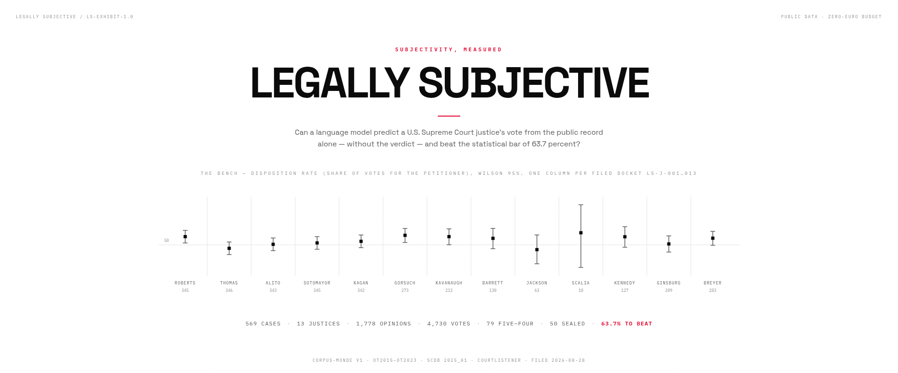
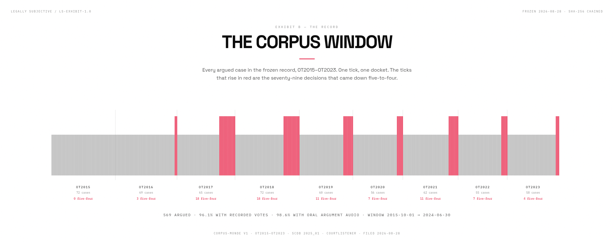
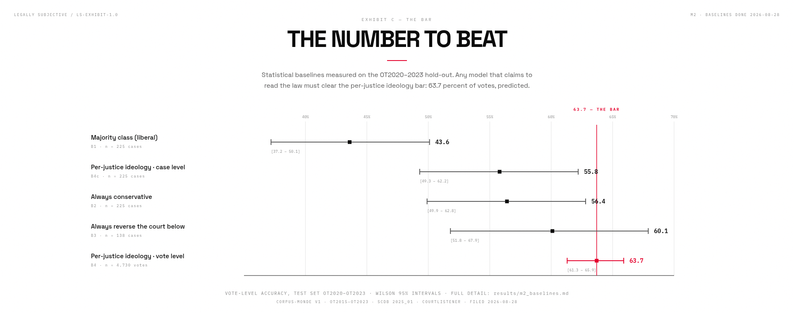
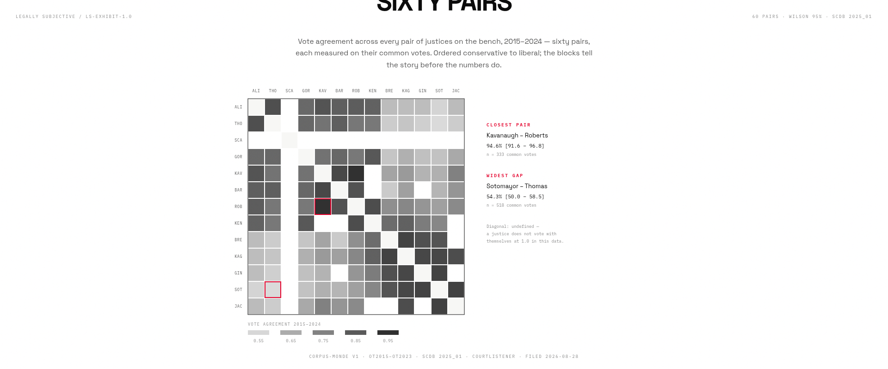
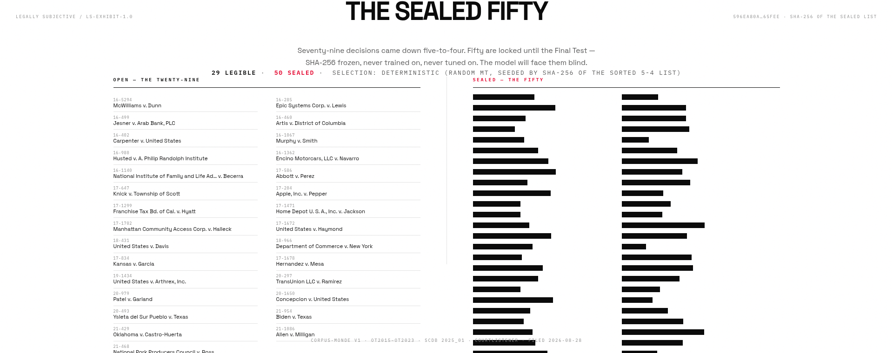
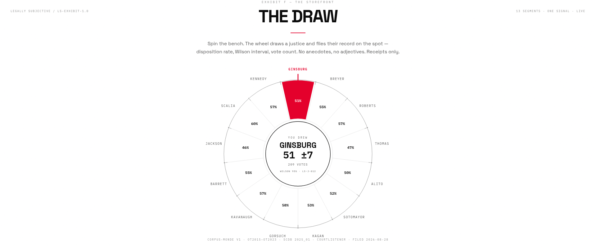

# The Legally Subjective Report — A to Z

> **LS-R-003 · The full project record.** Everything this project is, does,
> and refuses to do — filed from A to Z. Every number in this report traces
> to a filed document in `data/`, `results/`, or the git history; where a
> thing is not yet done, this report says so. Filed 2026-08-29.

---

## A — The Ambition

Legally Subjective asks one question: **can a language model predict a
U.S. Supreme Court justice's vote from the public case file alone —
without the verdict — and does teaching it that justice's own style make
it better on that justice's future cases?** The question is deliberately
double-edged. If the answer is yes, judicial subjectivity leaves a
measurable footprint in public text, and the "persona" of a judge is
partially extractible, quantifiable, reproducible. If the answer is no,
then the essential part of a decision is not in the public data — and
that absence is itself a publishable finding about the limits of
predicting courts from text. Either way, the measurement is the
contribution. The project is therefore built to make both outcomes
equally respectable: baselines are pre-registered, test cases are sealed
by hash before any model trains, and the site displays the true state of
the program at every step. Nothing here is a demo of a product; it is an
instrument pointed at a question.

## B — The Beginning

The repository's own history is part of the method. The project was
rebuilt twice, and each rebuild left a visible scar and a lesson. On
2026-08-27 the repo carried an earlier iteration that did not survive
its own audit: **LS-AUDIT-001**, an instruction report that judged the
project against itself and issued twelve injunctions — the most
consequential being *"uncertainty becomes the brand"* (commit `d60c9ac`,
"sentence: the audit's 12 injunctions executed"). The sentence was
executed, not appealed: every number since carries its interval, every
claim carries its provenance, and every unwritten result is displayed as
unwritten. The next day the project pivoted to the **Corpus-Monde**
design (commit `e8adf70`): one frozen corpus of real Supreme Court
cases, statistical baselines first, models second. The front-end —
**THE DRAW**, the roulette that had been the storefront of the earlier
iteration — was restored from history in full (commit `8aced95`) and
later "transfused": its colors, style, interactions and symbols kept at
one hundred percent, while the data layer underneath was regenerated on
the new corpus (see J). The report you are reading is itself part of the
record: it was filed the day the README became an exhibit system.

## C — The Corpus

**Corpus-Monde v1, frozen 2026-08-28** — the world the experiment runs
on. The rule: every *argued* case of the Supreme Court of the United
States in the window **2015-10-01 → 2024-06-30** (terms OT2015 through
OT2023), with filed-date validation through 2024-07-31. CourtListener
metadata is fused with per-justice votes from the Supreme Court Database
(SCDB, edition 2025_01). The result: **569 cases**, **1,778 opinions**
inventoried (majorities, dissents, concurrences), **4,730 recorded
votes** covering 96.1% of cases, and **98.6% audio coverage** (oral
argument audio + transcript — the pipeline is multimodal-ready). Every
raw source is hash-chained in `data/raw/provenance/`; the corpus rule,
its statistics and its known flaws are filed in
[`docs/02-CORPUS.md`](02-CORPUS.md). The freeze is real: the JSONL
archives carry their SHA-256 in `stats_v1.json`, and every downstream
artifact records which bytes it was computed from.

## D — The Dockets

The thirteen justices of the window each have a **FILED docket** —
`LS-J-001` (Roberts) through `LS-J-013` (Breyer) — written against the
**LS-1.0 "Subjectivity Fingerprint" standard** (restored from history in
commit `b252192`, now in [`standards/LS-1.0.md`](../standards/LS-1.0.md)).
Each docket measures real axes from public data: **disposition** (the
share of a justice's votes that favored the party asking the court for
relief, with Wilson 95% intervals), **temperament** (dissent rate — a
collegiality proxy, explicitly not a psychological assessment),
**precedent** (citation impact, rebased on citations received), and
**exposure** (publication rate). Percentiles are rank-median on the
thirteen-seat bench; uncertainty bands are bootstrap with 10,000
iterations, seeded by `sha256(docket|axis|LS-1.0)` so every figure is
reproducible bit-for-bit. Two axes remain honestly `null` where the data
does not support them — the docket shows the void rather than inventing
a number. The seals are verifiable: `scripts/verify_dockets.py` replays
all thirteen and checks them against the MANIFEST — 13/13 OK at filing
time.

## E — The Evidence

Provenance is not a feature here; it is the law of the house. Every
non-null value in a FILED docket traces to at least one public source
URI, cached with retrieval timestamps (`data/productions/custody.json`).
The tree hashes cover the exact corpus bytes each docket was computed
from. The exhibits in this report are not illustrations either: each one
is generated by script from the live JSON (see Q), so a figure that
disagrees with the data is a bug, and a figure that cannot be
regenerated is a fabrication. The same discipline runs through the site:
the wheel's numbers are read from the dockets at request time, never
hard-coded. This is what "the interface is evidence" means in practice —
UI-1.0 EXHIBIT, the design law of the front, bans decoration precisely
so that nothing on screen is unaccounted for.

## F — The Findings (so far)

Milestone M2 delivered the statistical baselines — the price of
admission for any future model, measured on the **OT2020–2023 hold-out**
(train prior: OT2015–2019), with Wilson 95% intervals:

| Baseline | Accuracy | 95% CI | n |
|---|---|---|---|
| B1 — Majority class (liberal) | 43.6% | [37.2; 50.1] | 225 cases |
| B4c — Per-justice ideology, case level | 55.8% | [49.3; 62.2] | 225 cases |
| B2 — Always conservative | 56.4% | [49.9; 62.8] | 225 cases |
| B3 — Always reverse the court below | 60.1% | [51.8; 67.9] | 138 cases |
| **B4 — Per-justice ideology, vote level** | **63.7%** | **[61.3; 65.9]** | **4,730 votes** |

The reading: knowing nothing but each justice's ideological lean already
predicts nearly two votes in three. **63.7% is the bar** — the number
the whole project is organized around, and the number displayed in red
across the site and this report. A model that cannot clear it does not
read the law; it reads the bench's median. Full derivation and the
caveats (including why the vote-level and case-level numbers differ)
live in [`docs/03-BASELINES.md`](03-BASELINES.md) and
[`results/m2_baselines.md`](../results/m2_baselines.md).

## G — The Gap (and the glue)

How much do thirteen judges actually disagree? The **B5 agreement
matrix** measures all **sixty pairs** on their common votes, 2015–2024.
The extremes frame the bench: the closest pair is **Kavanaugh–Roberts at
94.6%** [91.6; 96.8] (n = 333) — near-twins in voting terms; the widest
gap is **Sotomayor–Thomas at 54.3%** [50.0; 58.5] (n = 518) — a coin
flip's worth of agreement between the bench's opposite poles. The median
pair sits at 75.9%. Read against the 63.7% baseline, the matrix explains
why the bar is where it is: ideology sorts the bench into blocks whose
internal agreement runs high, so a model that learns *only* the blocks
already captures most of the predictable variance. The persona question —
whether there is signal *within* a block, inside one justice's own
record — is exactly what condition B of the protocol isolates.

## H — The Hold-out

Seventy-nine of the 569 decisions came down **5–4** — the closest
possible margin, where the subjectivity of one justice is maximally
consequential. Fifty of them are **sealed** for the Final Test:
selection was deterministic (Random MT, seeded by the SHA-256 of the
sorted 5–4 docket list), the sealed list itself is hashed
(`596ea80ae2478082dca3a4aef85b370f0b30b7f121f5ffb2a59c6778ee652fee`),
and the cases are excluded from every training and tuning decision. The
remaining twenty-nine are legible in the record and shown as such. The
sealing is the project's central act of self-restraint: it converts the
Final Test from a demonstration into an *exam* — one pass, four
conditions, no second try. The protocol is pre-registered in
[`docs/04-PROTOCOLE.md`](04-PROTOCOLE.md).

## I — The Interface

The site is the experiment's public face, and it follows one design law:
**UI-1.0 EXHIBIT — the interface is evidence.** White light, dense data,
zero decoration; one background, one ink, ONE signal red (`#e4002b`);
Grotesk speaks, Mono measures; structure is exposed as 1px rules; state
changes are cuts, not fades; every number is tabular and traces to a
filed document — or it does not exist. Dark mode is banned in this
house. The storefront is **THE DRAW**: spin the wheel, draw a justice,
and the exhibit files their record on the spot —
*"YOU DREW GINSBURG — 51 ±7 · 209 VOTES"* — disposition rate, Wilson
interval, vote count, no anecdotes. Around it: the court (thirteen
justices, their dockets), all 569 case pages (each carrying *the
baseline's call* — honestly labeled, because the model is M3-pending),
judge pages with divergence by issue area, the sixty-pair comparison,
the research paper (LS-R-002), the LS-1.0 standard, and a live
system-state page read from the data itself.

## J — The Journey of the front (the transfusion)

The front-end has a biography. THE DRAW was born in the earlier
iteration of the project, was lost when the workspace was rebuilt, was
restored from git history in full (commit `8aced95` — colors, style,
interactions, symbols, one hundred percent), and then underwent the
**transfusion**: the old front kept, the old data replaced. On
2026-08-28, `scripts/transfuse_v2.py` regenerated the entire data layer
in the exact formats the front already reads — thirteen re-measured LS-J
dockets on the real SCDB votes, the 569-case record with per-case
baseline calls (leak-free), the sixty-pair agreement, the research
state, the custody chain. The build was verified (569 case pages, 156
compare pages, 13+13 dockets), the wheel was tested in the browser, the
seals were replayed — and five organic commits landed on `main`
(`d92ed50` data, `c8abccb` front, and their siblings), all signed by the
owner. The site you can run today is that transfused front: old body,
new blood, zero cosmetic change.

## K — The Known unknowns

An honest list beats a surprise; the full limits dossier is
[`docs/08-LIMITES.md`](08-LIMITES.md). The essentials, stated plainly.
**First**, the SCDB coding is an interpretation, not a truth: our
directional "ground truth" (conservative/liberal) comes from human
coders following a contestable guide — one artifact among several: in
this window, `partyWinning` was coded 1 in 364 of 368 cases, so that
baseline was discarded outright. Accuracies here are accuracies
*relative to the SCDB coding*. **Second**, the persona is not the
person: an adapter finetuned on public opinions captures at best a
public decisional style — not the Wednesday conferences, not the opinion
negotiations. "B = A" would not mean judges are interchangeable; only
that their public texts carry no additional measurable signal at this
scale. **Third**, corpus size: 569 cases is enormous for a free project
and tiny for fine statistical inference — with ~225 test cases,
accuracy gaps smaller than ~10 points between conditions are hard to
separate from noise. Modest real effects will pass unseen. That is
assumed, and documented, and it is why intervals accompany every number.

## L — The Ledger

The milestone record, as filed:

| Date | Milestone | State |
|---|---|---|
| 2026-08-27 | Audit LS-AUDIT-001 · twelve injunctions · sentence executed | done (`d60c9ac`) |
| 2026-08-27 | LS-R-001 — the science: train the model for real | done (`e913215`) |
| 2026-08-27 | THE DRAW — the roulette is the storefront | done (`a3f38a7`) |
| 2026-08-28 | Pivot to Corpus-Monde SCOTUS — project skeleton | done (`e8adf70`) |
| 2026-08-28 | M1 — collection chain (segmented bulk + search API) | done (`d31c0a6`) |
| 2026-08-28 | **M1 — Corpus-Monde v1 frozen (569 cases)** | done (`9d628c6`) |
| 2026-08-28 | M2 — statistical baselines, the bet to beat | done (`d5eed39`) |
| 2026-08-28 | The static site — Subjectivity, measured | done (`6376d3d`) |
| 2026-08-28 | Front restored in full from history | done (`8aced95`) |
| 2026-08-28 | LS-1.0 standard restored from history | done (`b252192`) |
| 2026-08-28 | M1.5 collector in quota mode (`--wait-on-429`) | done (`390cf62`) |
| 2026-08-28 | **The transfusion — the site runs on Corpus-Monde v1** | done (`d92ed50`, `c8abccb`) |
| 2026-08-28 | M1.5 proactive pacing (token physics measured) | done (`7ec7c9e`) |
| 2026-08-29 | LS-EXHIBIT-1.0 visual system + English README + this report | this filing |

## M — The Method

The Final Test compares four conditions on the same hold-out:

| Condition | What it is |
|---|---|
| **A — Zero-shot** | Llama 3 8B decides from the dossier alone; no learning of its own |
| **B — Persona** | the same model, QLoRA-finetuned on one justice's **past** opinions; tested on that justice's **future** cases |
| **C — Context** | the same model + retrieval of similar earlier opinions (RAG) |
| **D — Statistical** | the M2 baselines |

The decisive comparison is **B vs A on never-seen future cases**. B > A
⟹ the persona is extractible from public text. B = A ⟹ the personality
is not in the data. Both outcomes are results, and the protocol is
pre-registered so neither can be spun after the fact. Training design
(M3, pending): Llama 3 8B quantized to 4 bits, QLoRA with rank 16–64,
nine adapters ("La Chambre" — Roberts through Jackson; Jackson's
notoriously small corpus gets an explicit power caveat), 1–3 epochs with
early stopping, all on free Colab/Kaggle GPU. Anti-memorization audits
(min-k% probability + cloze tests) ship with every adapter, because a
model that memorized the future is not an oracle, it is a leak.

## N — The Numbers

The whole record in one table — every figure filed elsewhere in this
report, gathered for the ledger-minded:

| Quantity | Value | Filed in |
|---|---|---|
| Argued cases, OT2015–OT2023 | **569** | `stats_v1.json` |
| Justices with FILED dockets | **13** | `data/dockets/` |
| Opinions inventoried | **1,778** | `stats_v1.json` |
| Recorded votes | **4,730** | `research_state.json` |
| Cases with SCDB votes | 96.1% (547/569) | `stats_v1.json` |
| Oral-argument audio coverage | 98.6% (561/569) | `stats_v1.json` |
| Five-four decisions | **79** | `stats_v1.json` |
| Sealed for the Final Test | **50** | `five_four_selection` |
| The bar (B4, vote level) | **63.7%** [61.3; 65.9] | `results/m2_baselines.md` |
| Closest pair | Kavanaugh–Roberts 94.6% | `agreement.json` |
| Widest pair | Sotomayor–Thomas 54.3% | `agreement.json` |
| Median pair agreement | 75.9% | computed on `agreement.json` |
| One-vote-margin cases | 81 | `research_state.json` |
| Dockets verified | 13/13 | `scripts/verify_dockets.py` |
| Opinion texts collected (M1.5) | in progress — see O | `state.json` |

## O — The Opinions (the drip)

Milestone **M1.5** collects the full text of the 1,778 inventoried
opinions through the CourtListener API — the one step that cannot be done
from bulk files alone (the 2026-06-30 bulk opinion archives weigh 29–54 GB
and their SCOTUS coverage after 2015 is documented as absent). The free
API token has measured physics: **5 requests per minute and roughly
50–60 requests per rolling hour** (Retry-After headers observed up to 588
seconds). The collector therefore runs in *resumable drip passes*: each
pass sleeps 75 seconds between requests — the proactive pace that
maximizes throughput without ever tripping the hourly wall
(commit `7ec7c9e`, "--pace 75"), and every fetched opinion is
checkpointed to `state.json` before the next request. The honest ETA at
this physics is ~35 hours of dripping for the full set. The collection
is designed to *complete* the corpus without changing its identity: the
M1 freeze stands, the texts only fill in what the inventory already
lists. Once collected: deduplication of re-ingested slip opinions
(similarity ratio ≥ 0.95), normalization of headers and page numbers,
and the per-justice temporal split (cutoff = two years before the
corpus end; everything before is train, the rest is future test) with an
automatic zero-leakage audit log.

## P — The Principles

Four principles govern every decision in this repository, and each one
has teeth. **Zero euro, forever**: free Colab/Kaggle compute, public
data, no paid service at any step — the constraint is treated as a
design force, not an apology (see Z). **Amateur, seriously**: the
project must remain playable, criticizable and verifiable by anyone
with a laptop, while being rigorous enough to interest a researcher —
hence sealed tests and pre-registration in a hobby-shaped project.
**Total provenance**: every file has its SHA-256, every rule its
predicate, every exception its note; a number that cannot be traced is
treated as not existing. **No commercialization**: no product, no
paywall, no private data — the outputs (corpus, dockets, adapters,
figures) are published for reuse under open licenses (code MIT, data
CC BY 4.0). The ethics dossier
([`docs/06-ETHIQUE.md`](06-ETHIQUE.md)) adds the researcher's duties
here: public data only, counterfactuals labeled as such, and no claim
about persons — only about public texts.

## Q — The Quality bar (the exhibits)

This report and the README are set in **LS-EXHIBIT-1.0**, a visual
system adapted from the AEGIS Visual Guide — a proven
exhibit-production manual from another discipline (physics
visualizations) — and re-grounded in this project's own design law.
The adaptation was deliberate, not cosmetic: the AEGIS signature (dark
`#0d1117`, amber accent, glow, grain) was replaced by the house
identity (white paper `#ffffff`, ink `#0a0a0a`, one signal red
`#e4002b`, 1px rules, no radius, no shadow, no gradient), because a
legal project's visuals must read as *filed evidence*, not as mission
control. What survived from the template is the craft: everything
centered; typography as hierarchy (Space Grotesk speaks, IBM Plex Mono
measures, tabular numbers everywhere); procedural SVG generated from
the real JSON by seeded RNG; exact canvas dimensions verified by
byte-level PNG header checks; and a quality gate — each exhibit was
reviewed by a vision model as a hostile art director and iterated until
it passed. The full rulebook, including the one documented rule-break
(there is no dark variant — the paper has one face), is
[`docs/10-VISUAL-GUIDE.md`](10-VISUAL-GUIDE.md).

## R — The Reproducibility

Everything rebuilds from public inputs. The chain: bulk CourtListener
archives → filter predicates (exact, filed) → Corpus-Monde v1 →
`stats_v1.json` with source hashes → LS-J dockets → the site's data
layer. The rebuild manual is
[`docs/05-REPRODUCTIBILITE.md`](05-REPRODUCTIBILITE.md); the integrity
check is two lines of Python (see the README); the docket seals replay
via `scripts/verify_dockets.py`; and the exhibits themselves regenerate
from the live JSON — the HTML sources sit next to their PNGs in
`docs/assets/`, so even the figures are auditable. The one step that
requires patience rather than money is the opinion-text drip (see O) —
it is rate-limited by the API's free tier, resumable by design, and
checkpointed so that no pass is ever wasted.

## S — The Status

The honest state of the program, as of this filing (2026-08-29):

| Milestone | State |
|---|---|
| M1 — Corpus-Monde v1 | **frozen** (2026-08-28) |
| M2 — baselines | **done** — the bar is 63.7% |
| M1.5 — opinion texts | **in progress** — dripping, resumable, ~35 h at token physics |
| The site | **live on the corpus** — transfused, sealed, verified |
| M3 — persona training | **pending** — QLoRA plan filed, free GPUs |
| M4 — the Final Test | **sealed, not run** — one pass, four conditions |

Nothing in the "pending" rows is faked anywhere on the site: pages that
concern untrained models display the statistical baseline and say so.

## T — The Test

The Final Test (M4) is designed to be run exactly once. One pass over
the fifty sealed five-four cases, all four conditions (A/B/C/D) evaluated
identically, results published whatever they are — the pre-registration
forecloses the temptation to re-run until something flattering appears.
The fifty cases are the right exam precisely because they are the
hardest: one-vote margins where a single justice's subjectivity is the
margin. If condition B (the persona) beats condition A (zero-shot) on
these blinds, the excess accuracy is the *measured footprint of judicial
subjectivity* in public text. If it does not, the project files the
null result with the same typography as a success — that symmetry is
the entire point of the sealing protocol.

## U — The Uncertainty

Uncertainty is not a footnote in this project; it is the brand (the
audit said so, and the sentence was executed). Concretely: every
proportion is reported with a **Wilson 95% interval**, chosen over the
naive normal approximation because it behaves correctly at the extremes
where supreme-court vote shares live; justice-level docket values carry
**bootstrap bands over 10,000 seeded iterations**; baseline comparisons
are read *through* their intervals — with ~225 test cases, any gap
narrower than ~10 points is honestly reported as indistinguishable from
noise. The number 63.7% is meaningless without [61.3; 65.9], and the
project's typography refuses to let one appear without the other. This
is also why the site's wheel prints "51 ±7", not "51": a point estimate
wearing an interval is the house style of truth.

## V — The Verdict (so far)

What can already be said, before a single model is trained? Three
things. **First**, the predictable floor of Supreme Court voting is
high: 63.7% of votes are called by per-justice ideology alone — anyone
claiming AI "predicts the Court" below that bar is predicting nothing a
lookup table could not. **Second**, the bench's disagreement structure
is block-shaped: sixty pairs with a 94.6% twin pair and a 54.3% opposed
pair, median 75.9% — the variance a persona model could plausibly add
lives *inside* those blocks, which is exactly where the sealed exam
aims. **Third**, the infrastructure is done and honest: frozen corpus,
sealed test, pre-registered protocol, verified dockets, an interface
that cannot lie. Whether the persona exists in the text is still an
open question — but the instrument to measure it is built, filed, and
waiting for M3.

## W — The Work ahead

The remaining road is short and explicit. **M1.5** (in progress): finish
the opinion-text drip, deduplicate slip opinions, normalize, cut the
per-justice train/future-test split with a zero-leakage audit. **M3**:
train the nine persona adapters (QLoRA, 4-bit Llama 3 8B, free GPUs),
run the anti-memorization audits, publish adapters on Hugging Face and
the training notebook. **M4**: run the Final Test once — one pass, four
conditions, fifty sealed cases — and file the results. Beyond that, the
roadmap keeps ideas explicitly *unpromised*: a multimodal condition
using the 98.6%-coverage oral-argument audio; a model-vs-judge
agreement matrix (does the persona predict *other* justices' votes
better than its own? — a style-vs-substance probe); extension to
federal courts of appeals using the same pipeline. Ideas, not
commitments — the roadmap is the law, and it says so.

## X — The eXhibits

The six exhibits of the LS-EXHIBIT system, as filed (each as two SVG
faces — `.light.svg` / `.dark.svg` — mounted through a `<picture>`
element so GitHub itself picks the reader's face):

| Exhibit | File | What it shows |
|---|---|---|
| A — The project | `docs/assets/hero.{light,dark}.svg` | the bench, thirteen dockets, disposition + Wilson |
| B — The record | `docs/assets/corpus-window.{light,dark}.svg` | 569 ticks, the seventy-nine five-four in red |
| C — The bar | `docs/assets/baselines.{light,dark}.svg` | five baselines, 63.7% in signal red |
| D — The lock | `docs/assets/sealed.{light,dark}.svg` | 29 legible, 50 redacted |
| E — The bench | `docs/assets/agreement.{light,dark}.svg` | the 13×13 matrix, extremes marked |
| F — The storefront | `docs/assets/the-draw.{light,dark}.svg` | the wheel, one drawn justice |

Each file is generated from the live JSON by `scripts/make_exhibits.py`
and gated by `scripts/qa_exhibits.py` (structure, WCAG AA contrast,
raster canary, margin law), following
[`docs/10-VISUAL-GUIDE.md`](10-VISUAL-GUIDE.md).

> **Erratum (2026-08-29).** This report was filed against
> LS-EXHIBIT-1.1 (single-file adaptive SVGs, PNG listings above).
> Field review on GitHub showed the internal `prefers-color-scheme`
> query never fires in the camo `` context — dark-mode readers
> got invisible ink. The system was refounded as LS-EXHIBIT-1.2 (two
> files per exhibit, one `<picture>`, contrast gated by the build),
> and the index above reflects it. One legend bug was found and fixed
> in the same pass: the agreement exhibit labeled the widest pair as
> "closest" and vice-versa.

## Y — The Yield

What this project gives away, regardless of how the experiment ends:
a **frozen, hash-chained corpus** (569 cases, 1,778 opinions, SCDB
votes fused) reusable by anyone studying the Court; a **standard**
(LS-1.0) for measuring a judge from public data with honest voids; a
**protocol template** (seal-by-hash, pre-register, run once) that costs
nothing and disciplines everything; a **set of statistical baselines**
with intervals, so that future "court-predicting AI" claims can be
priced against a real bar; nine eventual **persona adapters** with
anti-memorization audits; and a **visual system** (LS-EXHIBIT-1.0) with
its rulebook, so the exhibits themselves are reproducible. All of it
MIT/CC-BY, all of it rebuildable on a laptop plus patience.

## Z — The Zero

The budget is zero euros, and that number is load-bearing. It forced
the corpus to come from public archives instead of purchased data; it
forced the compute plan onto free tiers (Colab/Kaggle, 4-bit
quantization, QLoRA instead of full finetunes); it forced the API
collection into a patient drip that any student could resume; and it
forced the honesty — with no money to buy scale, the project's only
currency is rigor. A zero-euro project cannot bluff. It can only file.
This report is filed.

---

*LS-R-003 · Legally Subjective — Subjectivity, measured · 2026-08-29 ·
Every number traces; every gap is named.*
